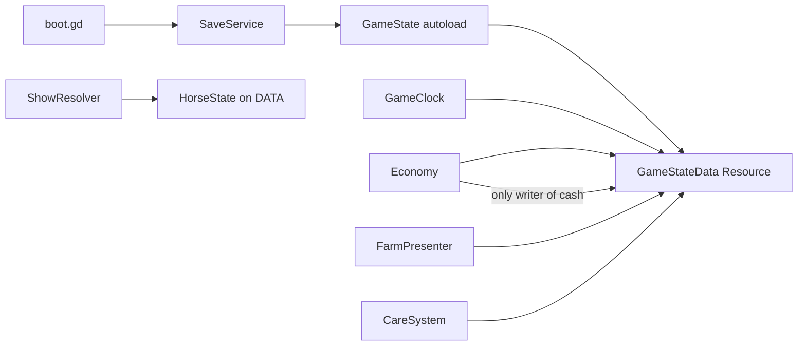
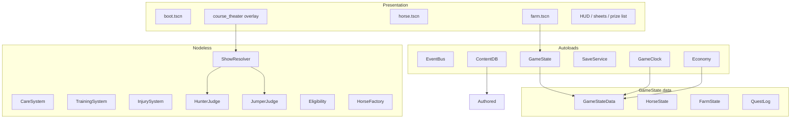
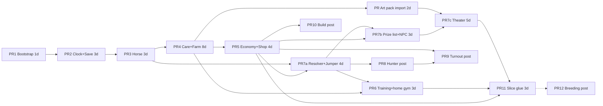

# Livia's Stable — Design Document

| Field | Value |
|---|---|
| **Title** | Livia's Stable: Hunter/Jumper Farm + Show Career |
| **Godot `config/name`** | `Livia's Stable` |
| **Author** | TBD |
| **Date** | 2026-08-16 |
| **Revised** | 2026-08-16 (owner decisions) |
| **Status** | Approved |
| **Engine** | Godot **4.7.1-stable** (2026-07-14). **Pin this.** 4.7.2 is RC1 as of 2026-08-16; do not move until 4.7.2-stable. Do not track 4.8-dev. Feature tag is `4.7` (not `4.7.1`). |
| **Language** | GDScript |
| **Platform (v1)** | Desktop, Windows first, 1920×1080 baseline, mouse + keyboard |
| **Workspace** | `c:\Users\rich\Projects\Horse Game` (empty greenfield; no existing Godot project) |
| **Related but out of scope** | `HorseHelp` (farm-sitting marketplace), `Video Game/Smalls Reports` (unrelated Godot 4.7 title). Borrow only engine conventions (4.7 + Forward Plus + script autoloads), not content. |
| **Team / calendar** | Solo GDScript. Vertical slice is **8–12 weeks** with the recut PR graph. |

Official name: **Livia's Stable**. Window title, README, boot label, and all player-facing copy use that name. Folder on disk stays `Horse Game` (do not rename the workspace).

Retired working titles (do not use as the product name): *The Ingate*, *Rails & Ribbons*, *Course Walk*, *Close Contact*, *Over Fences*, *The Prize List*.

---

## Overview

Livia's Stable is a single-player Hunter/Jumper life-sim: you run a small show barn, care for horses, school them, haul to shows, and grow from a four-stall starter farm into a competitive H/J program. The fantasy is specifically **hunter/jumper culture** — close-contact saddles, hunter scores in the 80s, jumper Table II jump-offs, braiding the night before, scope vs. carefulness, and a ladder of heights — not racing, not western, not a generic “horse stat” pet sim.

The game is a **management sim with a cinematic course-run**, not a riding physics game. Farm, care, training, economy, and prep are the core loop. Shows play as a **course-running theater**: the camera follows the horse around a real course of jumps; the outcome is resolved from horse stats, schooling, tack, rider skill, prep, and a few optional approach decisions. V1 ships a click-to-manage **stylized 3D diorama farm** and a PathFollow3D course theater with a 6–8 clip horse pack.

Heights are **not** aliased across sports. Jumpers are authored and labeled in meters (`0.80 m`). Hunters are authored and labeled in feet/inches (`2'6"`, stored as `0.76 m`). They are sibling schooling heights, not the same class.

---

## Background & Motivation

There is no existing game in this workspace. Adjacent horse software (`HorseHelp`) is a real-world barn-sitting marketplace and contributes no engine code. The closest Godot reference in the user’s tree is an unrelated 4.7 Forward Plus project; this title starts from a new project.

Pain the design is solving:

1. **Generic horse games flatten H/J.** Speed + jump + affection is the wrong stat set. Hunters are judged on style, manners, even pace, and form. Jumpers are judged on rails, refusals, and time. Those are different sports that share a barn.
2. **Full riding sims do not ship as a solo management game.** A physics ride would consume the entire v1 budget.
3. **Animation is the ship-blocker.** Presentation is designed so one purchased stylized horse pack with a listed clip set is enough.
4. **Players must earn the height ladder.** Instant Grand Prix is the failure mode. Schooling and mileage change the trip; a cruelty-hard gate stops true overfacing; a soft warning lets a slightly green horse go in and look green.

---

## Goals & Non-Goals

### Goals (v1 / vertical slice)

- Own **1–2 horses** on a **4-stall** starter farm with one paddock and one outdoor arena.
- A **day-phase care loop** that is satisfying for a 45–90 minute session: feed, stall, turnout, groom, school, sleep.
- School over fences in the home arena (flat + poles + a small gymnastic that uses the **same** `ShowResolver` as the show).
- Enter **one local schooling show**, run **one jumper class at 0.80 m**, get a **ribbon and a check ($15–$180)**. Hunter **2'6" (0.76 m)** is the next increment, not required to call the slice done.
- Spend that check on **one tack item or the shop footing upgrade** (no construction PR required).
- Data-driven content: horses, tack, buildings, shows, courses, quests as `Resource` (`.tres`).
- Local single-player save, versioned, with a migration hook.

### Non-Goals (v1)

- Multiplayer, live-service, IAP, always-online.
- Full 3D riding physics, ragdolls, or rider IK.
- Equitation division (stretch after Season 2).
- Breeding, gestation, young-horse pipeline (Season 2). Genome **shape** exists from PR 3.
- Boarders, lesson program, pro catch-rides (later).
- Rated USEF/USHJA points, year-end standings (Season 2 calendar layer).
- Photoreal horses, AAA animation, open-world trail riding, player locomotion on the farm.
- Copying trademarked USEF/USHJA class lists, logos, or prize-list language. Inspired structure only.
- Controller support (input map can be added later; do not block v1).
- macOS/Linux export (keep the project portable; do not test-gate v1 on them).
- Graphic or frequent injuries. Clinical, rare, non-gore. Closed — not an open product question.

---

## Key Decisions

| # | Decision | Rationale |
|---|---|---|
| K1 | **Godot 4.7.1-stable**, feature tag `4.7`, renderer **Forward Plus**, 3D physics **Jolt** (on, unused for gameplay) | Latest stable. 4.7.2-rc1 exists; stay on 4.7.1 until it is stable. Matches the user’s other 4.7 project. |
| K2 | **GDScript, not C#** | Resource/inspector workflow. No physics/perf need for C#. |
| K3 | **Official name: Livia's Stable** | Owner decision. `config/name`, window title, README, boot label, and player-facing copy. Folder stays `Horse Game`. *The Ingate* is a retired working title only. |
| K4 | **Stylized 3D diorama farm + cinematic 3D course theater. Locked.** | Click-to-manage orbit camera. No player locomotion. 6–8 baked clips. **2.5D is an emergency fallback only if the horse pack fails evaluation**, not an open art-direction fork. `CoursePresenter` keeps the hatch. Confirm nothing — implement 3D. |
| K5 | **Phase calendar, not real-time days** | Morning / Afternoon / Evening. Night is a transition, not a fourth phase. 4 seasons × 4 weeks × 7 days = **112-day year**. |
| K6 | **Hybrid shows: stat-resolved + course theater + optional approach decisions** | Deterministic given sim `Rng`. Presentation never rolls. |
| K7 | **Jumper first on screen and in code** | Owner: the slice class the player sees is Ashford **0.80 m jumper**. Hunter 2'6" stays behind `discipline_hunter_enabled` (PR 8). PR 7a remains discipline-agnostic fence events, then the jumper judge. |
| K8 | **Authored content = `.tres`. Saves = versioned JSON** | Never `ResourceSaver` the live game state. |
| K9 | **Six autoloads. `GameState` autoload holds a `GameStateData` Resource.** | Autoloads: `EventBus`, `GameClock`, `Economy`, `SaveService`, `ContentDB`, `GameState`. No `HorseManager`. See [Ownership](#gamestate-ownership). |
| K10 | **`HorseDef` (template) vs `HorseState` (instance)** | Never mutate a `.tres`. Factory always builds a new `HorseState`. |
| K11 | **Snap-to-plot construction, not free-place voxels** | 4×5 plot grid. Construction is PR 10 and is **not** a slice dependency. Slice footing is a shop flag on the existing arena. |
| K12 | **Hidden numbers, shown language. Locked.** | No raw talent on the horse sheet. F3 / `debug_reveal_stats` is the notebook. Do not redesign this for v1. |
| K13 | **Hard gates + soft overfaced** | Hard: soundness, energy, age, pay, cruelty (`schooled_height_m + 0.20 < class.height_m`). Soft warning + resolver penalty if `schooled_height_m + 0.05 < class.height_m`. Unschooled-at-height horses can go in (within 20 cm) and look worse. |
| K14 | **Breeding is Season 2. Genome is two-allele pairs from PR 3.** | `GenePair {allele_a, allele_b}` per key. No float-only genome that Season 2 would migrate. |
| K15 | **Fictional circuit, no trademarks** | Inspired-by Table II / hunter numeric scores. No USEF/USHJA names or logos. |
| K16 | **`GameState` autoload holds `GameStateData`** | Brothers-style access (`GameState.data`) without making every system a mega-manager. |
| K17 | **Calendar units are closed** | 1 game year = 1 horse year. `age_months += 3` on each `season_started`. After WINTER, `season = SPRING` and `year += 1`. Farrier every **14 game days** (2 game weeks ≈ 6.5 real weeks on a 16-week year). See [Simulation tick](#simulation-tick). |
| K18 | **Owner-rider. `rider_skill` is a scalar on the player, frozen in v1.** | No hired-pro roster. `GameStateData.player.rider_skill = 35.0` and does not increment until Season 1 lessons. |
| K19 | **CourseTheater is an overlay, not `change_scene`** | Farm stays in the tree, `process_mode = PROCESS_MODE_DISABLED`. Theater is `add_child` on `/root`. Exit frees theater and re-enables farm. |

---

## GameState ownership



`GameState` (autoload, `src/autoload/game_state.gd`, extends `Node`):

```gdscript
extends Node
var data: GameStateData
var sim_rng: Rng          # wrapper; seed/call_count mirrored onto data

func new_game(config: GameConfig, horse_name: String, coat: Enums.CoatColor) -> void:
    data = GameStateData.new()
    data.seed = randi() if config.use_os_seed else config.debug_seed
    sim_rng = Rng.new()
    sim_rng.reset(data.seed, 0)
    # layout + HorseFactory.instantiate(starter_bayberry) + apply_player_identity(name, coat)

func replace_data(d: GameStateData) -> void:
    data = d
    sim_rng = Rng.new()
    sim_rng.reset(d.seed, d.rng_call_count)
```

Reference rules:

- `Economy.post` is the **only** writer of `GameState.data.cash`. It reads `GameState.data` directly (autoload). No injection container.
- `GameClock` reads/writes `GameState.data.clock` and calls nodeless systems with `GameState.data` as the argument.
- Presenters read `GameState.data`; they never keep a stale copy of `HorseState` across a phase.
- `SaveService.save` serializes `GameState.data.to_dict()` plus `sim_rng.call_count`.
- `SaveService.load` parses JSON, `migrate`s, `GameState.replace_data(GameStateData.from_dict(...))`.

This is option (a) from review: closest to Brothers, still not a mega-manager.

---

## Vertical Slice (MVP)

A new player should finish this in **one sitting (~60–90 minutes)** and feel they ran a barn.

**Start**

- Cash: **$10,000**.
- Farm: 4-stall shedrow, 1 small paddock, 1 outdoor arena with 6 standards + 10 poles, dirt footing (`footing_quality = 40`) on the **arena** instance.
- Horses: one starter from `starter_bayberry.tres` — 10 yo KWPN gelding, 16.2 hh, competitive at **0.80 m jumper**, green at **3'0" hunter (0.91 m)**. At new game the player **types a name** (placeholder **Bayberry**) and **picks a coat** (bay / chestnut / grey / black). Sex, breed, age, markings (`star`), and talents stay locked. Second stall empty.
- Tack: one close-contact saddle (`condition = 70`, all mods 0), one snaffle bridle, no boots.
- `player.rider_skill = 35` (frozen).
- Calendar: year 1, Spring, week 1, **weekday 0 = Monday**, Morning.
- Quest: *“Schooling Saturday — enter the 0.80 m jumper at Ashford Schooling.”*

**Loop**

1. Morning: grain + hay, pick stalls, turnout, glance at horse sheet.
2. Afternoon: school (flat, poles, or gymnastic). Home gymnastic uses `ShowResolver` (recap card until theater exists).
3. Evening: bring in, night hay, groom.
4. Mid-week: farrier not yet due (seeded `last_farrier_abs_day = -4`, due on day 10). Shop: hay, boots, martingale, **arena footing upgrade**.
5. Friday Evening: optional braid (hunter later). **Load trailer**: pay $40, `energy -= 10`, horse `phase_busy` this Evening only. Saturday Morning is a normal feed.
6. Saturday Afternoon: walk the course (no mechanical bonus), enter, ride, ribbon + **$15–$180**, quest complete.
7. Sunday/Monday: buy **either** footing upgrade **or** open-front boots. Slice complete.

**Explicitly out of the slice:** breeding, snap-to-plot construction of new building types, rated shows, hunter class (PR 8, flagged `discipline_hunter_enabled`). If time is tight after 7c, **ship jumper-only**.

**Success criteria**

- Skip **two consecutive morning feeds** (evenings still fed) and **that day’s afternoon** school/show is dull (`hunger < 30`: rideability −10, more rails). Resume feeding and they are back above 30 by the next morning feed. Dullness does **not** persist to Saturday through normal keep. See worked decay below.
- An overfaced / low-schooling horse that still clears the cruelty gate has a **measurably worse** `p_rail` / `p_refuse` (home gymnastic and the show). Eligibility does not hide this.
- The course run is fun to watch (art pack imported before 7c; capsules are not the slice exit).
- The ribbon-to-upgrade beat lands via the **shop**, not construction. Footing is mechanical at **home** (next gymnastic); boots are mechanical everywhere. Saturday at Ashford does **not** use the farm’s footing.

---

## Proposed Design

### High-level architecture



**Rule:** `src/care`, `src/training`, `src/show`, `src/horse/horse_factory.gd` are `RefCounted` / static. They take `HorseState` + defs + `Rng` and return result objects. They are the only callers of `Rng`.

### Project layout

All paths under `c:\Users\rich\Projects\Horse Game`.

```
Horse Game/
├── project.godot
├── icon.svg
├── README.md
├── src/
│   ├── autoload/
│   │   ├── event_bus.gd
│   │   ├── game_clock.gd
│   │   ├── economy.gd
│   │   ├── save_service.gd
│   │   ├── content_db.gd
│   │   └── game_state.gd              # holds GameStateData
│   ├── core/
│   │   ├── enums.gd
│   │   ├── ids.gd
│   │   ├── rng.gd
│   │   ├── calendar.gd
│   │   ├── game_state_data.gd
│   │   └── game_config.gd
│   ├── horse/
│   ├── farm/
│   ├── care/
│   ├── training/
│   ├── tack/
│   ├── economy/
│   ├── show/
│   └── quest/
├── scenes/
│   ├── boot/
│   ├── farm/
│   ├── horse/
│   ├── show/
│   │   ├── course_theater.tscn        # runner + HUD shell
│   │   ├── jp_080_theater.tscn        # placed fences + Path3D for the slice course
│   │   └── course_runner.gd
│   └── ui/
├── resources/
│   ├── horses/starter_bayberry.tres
│   ├── tack/
│   ├── buildings/
│   ├── items/
│   ├── shows/
│   ├── courses/jp_080.tres            # sidecar; path lives in the theater scene
│   ├── quests/
│   └── config/game_config.tres
├── assets/models|textures|anim|audio|ui/
└── tests/
    ├── run_tests.gd
    ├── test_jumper_judge.gd
    ├── test_hunter_judge.gd
    ├── test_care_system.gd
    ├── test_save_migrate.gd
    ├── test_horse_factory.gd
    └── fixtures/                      # golden FenceEvent / ShowResult JSON
```

View scripts sit next to `.tscn`. Commit `.uid` files.

### Scene tree (runtime)

```
/root
├── EventBus, GameClock, Economy, SaveService, ContentDB, GameState   # autoloads
├── Farm (Node3D)
│   ├── WorldEnvironment / Sun / plots / buildings / HorsePresenter×N
│   ├── FarmCamera (SpringArm3D)
│   ├── HUD (CanvasLayer)
│   └── Modals (CanvasLayer)
└── CourseTheater (Node3D)                    # overlay, only while in-ring
    ├── instance of jp_080_theater.tscn
    ├── PathFollow3D / HorsePresenter
    ├── TheaterCamera
    └── ShowHUD
```

While the theater is up: `Farm.process_mode = PROCESS_MODE_DISABLED`. No `change_scene_to_*`.

No player `CharacterBody3D` in v1.

### Presentation approach (v1, locked)

**Farm:** stylized 3D diorama. Orbit 45–55°, zoom 12–40 m, click-drag, scroll, click to select.

**Horse:** one modular `horse.tscn`. Height scale 14.2→17.2 hh maps to ~0.88–1.12. Coat = albedo swap + marking atlas. No per-breed blendshapes.

**Required clips (pack evaluation checklist, PR Art):**

| Clip | Loop? | Root motion | Notes |
|---|---|---|---|
| `idle` | yes | no | stall / paddock / ingate |
| `walk` | yes | yes or in-place | if in-place, runner advances PathFollow |
| `trot` | yes | yes or in-place | |
| `canter` | yes | yes or in-place | |
| `jump` | no | preferred | one clip; runner scales `speed_scale` to fence height |
| `halt` | no | no | refusal freeze / finish |
| `eat` | yes | no | flavor |
| `spook` | no | no | optional; refusal look |

**Pack constraints:** single skeleton; a **saddle bone** (or withers socket) so a static rider silhouette can parent; CC0 / purchased royalty-free including game use; glTF. Prefer **in-place** loops (runner owns speed) over authored root motion. If the pack is root-motion, `CourseRunner` applies delta to `PathFollow3D.progress` instead of a constant gait speed.

**Art schedule:** evaluate and import **before PR 7c**. Capsules are legal through 7a/7b and farm PR 4. Slice success (“fun to watch”) is gated on PR Art + 7c, not on 7a.

**Fallback (only if pack evaluation fails):** same `CoursePresenter` (`play_gait`, `play_jump`, `drop_rail`, `show_refusal`) driving a 2.5D broadcast. Resolver unchanged. This is not a second art direction to choose in PR 4.

**Not in v1:** rider IK, cloth, tail IK, ragdoll falls (whistle + fade on `fall`).

---

## Simulation tick

```
Year  = 4 seasons (SPRING=0, SUMMER=1, FALL=2, WINTER=3)
Season = 4 weeks (1..4)
Week  = 7 days
weekday: MON=0, TUE=1, WED=2, THU=3, FRI=4, SAT=5, SUN=6
Day   = MORNING → AFTERNOON → EVENING → (transition) next MORNING
```

112 playable days / year. **1 game year = 1 horse year.**

**Absolute day** (saved, used by farrier / quests):

```
abs_day = (year - 1) * 112 + season * 28 + (week - 1) * 7 + weekday
```

New game: `year=1, season=0, week=1, weekday=0, phase=MORNING, abs_day=0`.

**Night is not a phase and not a fourth decay tick.** `advance_phase` from EVENING:

1. emit `phase_ended(EVENING)` → `CareSystem.apply_phase_decay(EVENING)`
2. run **once-per-day** night bundle (order is mandatory):
   1. `TrainingSystem.rest(horse)` for each horse — energy, soundness micro-heal, fitness/overwork
   2. `InjurySystem.tick(GameState.data)` — decrement days, recover
   3. hunger −10; clear `phase_busy`, `schooled_today`, `fed_morning`, `fed_evening`, `picked_stall_today`, `turned_out`
3. `GameState.data.clock.advance_to_next_morning()` (full wrap below)
4. if that call returns `season_changed`: every horse `age_months += 3`; emit `season_started`
5. emit `day_started`, `phase_started(MORNING)`

`GameClock` does **not** cache a `data` alias. Every read/write is `GameState.data` so `replace_data` on load cannot go stale.

```gdscript
# GameClock (autoload) — always GameState.data, never a cached alias
func advance_phase() -> void:
    var clock := GameState.data.clock
    EventBus.phase_ended.emit(clock.phase)
    CareSystem.apply_phase_decay(GameState.data, clock.phase)
    if clock.phase == Enums.Phase.EVENING:
        _run_night_bundle()
        var season_changed := clock.advance_to_next_morning()
        if season_changed:
            for h in GameState.data.horses:
                h.age_months += 3
            EventBus.season_started.emit(clock.season)
        EventBus.day_started.emit(clock)
        EventBus.phase_started.emit(Enums.Phase.MORNING)
    else:
        clock.phase = (clock.phase + 1) as Enums.Phase
        EventBus.phase_started.emit(clock.phase)

func sleep_until_morning() -> void:
    # Advance to the *next* morning. A no-op-if-already-Morning loop
    # would leave pause-menu Sleep and the 112-day wrap test stuck on day 0.
    if GameState.data.clock.phase == Enums.Phase.MORNING:
        advance_phase()
    while GameState.data.clock.phase != Enums.Phase.MORNING:
        advance_phase()
```

**Year wrap is required.** `Calendar.advance_to_next_morning()` (returns whether a season boundary was crossed):

```
phase = MORNING
weekday += 1
if weekday > SUN:          # 6
    weekday = MON          # 0
    week += 1
    if week > 4:
        week = 1
        season += 1
        if season > WINTER:   # 3
            season = SPRING   # 0
            year += 1
        return true           # season_changed (includes year wrap)
return false
```

Without the `season > WINTER` branch, `abs_day` and farrier math break on day 112.

**PR 2 headless test** (`tests/test_calendar_wrap.gd`, no horses): from `new_game` (already Morning), call this Sleep **112** times → `year == 2`, `season == SPRING`, `week == 1`, `weekday == MON`, `phase == MORNING`, `abs_day == 112`. Do **not** assert Bayberry here.

**PR 3** (or `test_care_system` once horses exist): same 112 Sleeps after instantiating Bayberry → `age_months == 132`.

**Who runs when**

| System | Trigger | Cadence |
|---|---|---|
| `CareSystem.apply_phase_decay` | every `phase_ended` | 3×/day (M, A, E) |
| `CareSystem.apply_feed` | player action, Morning or Evening | if skipped, decay handles it |
| `TrainingSystem.rest` | night bundle | 1×/day |
| `InjurySystem.tick` | night bundle | 1×/day |
| `Economy.accrue_daily` | `day_started` | 1×/day |
| `QuestLog.tick` | `day_started` | 1×/day |
| `age_months += 3` | `season_started` | 4×/year = 12 months |

Player actions consume that **horse’s** `phase_busy` for the current phase. Shows lock the entered horse’s Afternoon. Haul locks Friday Evening only.

**Farrier (closed):** due when `abs_day - last_farrier_abs_day >= 14`. Cost $150, sets `hoof = 90`, writes `last_farrier_abs_day = abs_day`. Overdue: `hoof` decays 2 points per additional day (min 20). Bayberry seeds `last_farrier_abs_day = -4` (due day 10).

**Aging / eligibility:** `age_years = floor(age_months / 12)`. Bayberry starts `age_months = 120`. A 4-year-old minimum is `age_months >= 48`. After one game year everyone is one year older.

### Care decay (closed)

Starting Bayberry (new game, Monday Morning, just-fed backstory):

| Field | Start |
|---|---|
| hunger | **85** |
| energy | 80 |
| fitness | 62 |
| soundness | 88 |
| hoof | 80 |
| happiness | 70 |
| cleanliness | 65 |
| turnout_score | 40 |
| bcs (`weight`) | 5.2 |
| stall dirt (stall 0) | 15 |

**Hunger**

| Event | Δ hunger |
|---|---|
| Morning feed (hay+grain) | `min(100, hunger+40)` |
| Evening feed (hay) | `min(100, hunger+28)` |
| Missed Morning | −38 |
| Missed Evening | −22 |
| Afternoon `phase_ended` (always) | −6 |
| Night bundle (always) | −10 |

`hunger < 30` → dull: `ride_eff − 10` (applied in resolver as a −10 on rideability before `ride_eff`), energy cap 50, trainer “dull”.

**Two-morning worked example (evenings fed, no school):**

| Step | hunger |
|---|---|
| Mon Morning start | 85 |
| Skip Mon Morning | 47 |
| Mon Afternoon end | 41 |
| Mon Evening feed | 69 |
| Night | 59 |
| Skip Tue Morning | **21** ← dull |

One skipped morning (41 after Monday afternoon) is not yet dull. Two consecutive skipped mornings is dull **that Tuesday afternoon**. Resume evening + Wednesday morning feeds and they are not dull by Saturday. The success criterion is the Tuesday-afternoon check, not a Saturday leftover.

**Other per-phase decay (`apply_phase_decay`):** uses barn `care_quality` (starter `barn_4` = **0.50**). Helper: `CareSystem.barn_care_quality(data)` → the occupied barn instance’s `BuildingDef.care_quality` (0 if no barn).

```
cq = barn_care_quality(data)                          # 0..1
if stalled and Morning ended without a pick:
    stall.dirt += 25.0 * (1.0 - 0.40 * cq)            # 0.50 → +20.0
# Afternoon/Evening: no dirt add
if idle this phase and not hauled:
    energy += 8                                       # work actions apply their own cost instead
if turned_out today:
    happiness += 4
if stall.dirt > 60:
    happiness -= 6.0 * (1.0 - 0.50 * cq)              # 0.50 → −4.5
```

A better barn (later `care_quality = 0.80`) adds less dirt and hurts happiness less. Slice starter barn is 0.50; the $1,200 spend does **not** change `care_quality` (it changes arena `footing_quality` only).

**Fitness / energy / soundness** live in `TrainingSystem.rest` (night bundle). Do not also apply a second fitness block here.

**BCS (`weight`, 1–9):** used. If `hunger < 30` for 3 consecutive mornings: `bcs -= 0.10`. If `hunger > 85` all week and grain fed: `bcs += 0.05`. `bcs < 4.0` → energy cap 60, training `fitness_gain * 0.7`. `bcs > 7.0` → `speed` effective −8, hunter manners −5.

**Haul (Friday Evening):** `Economy.post(&"haul", -40, ...)`, `energy -= 10`, `phase_busy = true` this phase only. No other energy tax. Saturday Morning is a normal feed. Saturday Afternoon is the class. A Friday-afternoon school + Friday-evening haul still lands Saturday `energy >= 30` after `TrainingSystem.rest` (see closed contract below).

---

## Runtime types

Every slice-saved or slice-ticked `class_name` lives here. Enums first.

### Enums (`src/core/enums.gd`)

```gdscript
class_name Enums

enum Phase { MORNING, AFTERNOON, EVENING }
enum Season { SPRING, SUMMER, FALL, WINTER }
enum Weekday { MON, TUE, WED, THU, FRI, SAT, SUN }
enum Sex { MARE, STALLION, GELDING }
enum Breed { HANOVERIAN, KWPN, HOLSTEINER, OLDENBURG, BWP, THOROUGHBRED, WELSH, CONNEMARA, WB_CROSS }
enum CoatColor { BAY, DARK_BAY, CHESTNUT, BLACK, GREY, SEAL_BROWN, BAY_PINTO }
enum Temperament { HONEST, QUIET, HOT, LAZY, SPOOKY }
enum Approach { STAY, WAIT, LEAVE }
enum Discipline { JUMPER, HUNTER }
enum FenceKind { VERTICAL, OXER, GATE, BRUSH, WALL, LIVERPOOL, CROSSRAIL }
enum QuestKind { BOARD, TRAINER, CALENDAR }
enum InjuryKind { BRUISE, FOOT_SORE, SOFT_TISSUE }
enum TrainingKind { FLAT, POLES, GYMNASTIC, HUNTER_COURSE, JUMPER_COURSE }
```

Never name an enum `Color`. Coats are `CoatColor`.

### Calendar

```gdscript
class_name Calendar
extends Resource

@export var year: int = 1
@export var season: Enums.Season = Enums.Season.SPRING
@export var week: int = 1                 # 1..4
@export var weekday: Enums.Weekday = Enums.Weekday.MON
@export var phase: Enums.Phase = Enums.Phase.MORNING

func abs_day() -> int:
    return (year - 1) * 112 + int(season) * 28 + (week - 1) * 7 + int(weekday)

func to_dict() -> Dictionary:
    return { "year": year, "season": int(season), "week": week,
             "weekday": int(weekday), "phase": int(phase) }

# Returns true if a season (or year) boundary was crossed.
func advance_to_next_morning() -> bool:
    phase = Enums.Phase.MORNING
    var s: int = int(weekday) + 1
    if s <= int(Enums.Weekday.SUN):
        weekday = s as Enums.Weekday
        return false
    weekday = Enums.Weekday.MON
    week += 1
    if week <= 4:
        return false
    week = 1
    var next_season: int = int(season) + 1
    if next_season > int(Enums.Season.WINTER):
        season = Enums.Season.SPRING
        year += 1
    else:
        season = next_season as Enums.Season
    return true
```

JSON uses the same integer encodings (`season: 0`, `weekday: 5` = Saturday).

### GameStateData

```gdscript
class_name GameStateData
extends Resource

@export var seed: int
@export var rng_call_count: int
@export var clock: Calendar
@export var player: PlayerState
@export var farm: FarmState
@export var horses: Array[HorseState]
@export var quests: QuestLog
@export var ledger: Array[LedgerEntry]     # cap 200
@export var in_progress_show: InProgressShow  # null if none
```

```gdscript
class_name PlayerState
extends Resource

@export var name: String = "Alex"
@export var cash: int = 10000
@export var rider_skill: float = 35.0      # frozen in v1
```

### Horse genome (two-allele, no Season 2 migration)

```gdscript
class_name GenePair
extends Resource

@export var allele_a: float = 50.0         # 0..100
@export var allele_b: float = 50.0

func mid() -> float:
    return 0.5 * (allele_a + allele_b)
```

```gdscript
class_name HorseGenome
extends Resource

const KEYS: Array[StringName] = [
    &"scope", &"carefulness", &"style", &"rideability", &"bravery",
    &"speed", &"stride", &"lead_changes", &"movement", &"conformation",
]

@export var pairs: Dictionary              # StringName -> GenePair
@export var coat: Enums.CoatColor
@export var color_alleles: Dictionary      # reserved Season 2; empty {} is fine

static func from_phenotypes(h: HorseState) -> HorseGenome:
    # homozygous snapshot for NPCs
    var g := HorseGenome.new()
    for k in KEYS:
        var p := GenePair.new()
        p.allele_a = h.get(k)
        p.allele_b = h.get(k)
        g.pairs[k] = p
    g.coat = h.coat
    return g
```

Season 2 breeding (not built): foal allele_a = pick one parent A/B, allele_b = pick other parent A/B, then `+= rng.randfn(0, 3)`.

### HorseDef / HorseState

```gdscript
class_name HorseDef
extends Resource

@export var id: StringName
@export var display_name: String
@export var barn_name: String
@export var breed: Enums.Breed
@export var sex: Enums.Sex
@export var height_hands: float
@export var age_years: int
@export var coat: Enums.CoatColor
@export var markings: PackedStringArray
@export var genome: HorseGenome
@export var express_sigma: float = 1.5     # 0 for Bayberry (deterministic phenotype = mid)
@export var temperament: Enums.Temperament
@export var papers: bool
@export var registry_flavor: String
# Authored condition defaults (copied, not genes)
@export var start_fitness: float = 60.0
@export var start_soundness: float = 88.0
@export var start_flatwork: float = 50.0
@export var start_gymnastics: float = 45.0
@export var start_hunter_schooling: float = 40.0
@export var start_jumper_schooling: float = 40.0
@export var start_schooled_height_m: float = 0.80
```

```gdscript
class_name HorseState
extends Resource

@export var uid: String
@export var def_id: StringName
@export var name: String
@export var barn_name: String
@export var breed: Enums.Breed
@export var sex: Enums.Sex
@export var height_hands: float
@export var age_months: int
@export var coat: Enums.CoatColor
@export var markings: PackedStringArray
@export var papers: bool
@export var registry_flavor: String

# Phenotype 0..100 (from genome + express noise)
@export var scope: float
@export var carefulness: float
@export var style: float
@export var rideability: float
@export var bravery: float
@export var speed: float
@export var stride: float
@export var lead_changes: float
@export var movement: float
@export var conformation: float
@export var temperament: Enums.Temperament

# Condition
@export var fitness: float
@export var soundness: float
@export var energy: float
@export var hunger: float
@export var happiness: float
@export var cleanliness: float
@export var weight: float                  # BCS 1..9
@export var hoof: float
@export var turnout_score: float

# Skills / mileage
@export var flatwork: float
@export var gymnastics: float
@export var hunter_schooling: float
@export var jumper_schooling: float
@export var schooled_height_m: float
@export var shows_at_height_mm: Dictionary # int mm -> int count  (800, 910, …) never float keys
@export var overwork: float

# Care flags (reset as noted)
@export var phase_busy: bool = false
@export var fed_morning: bool = false      # cleared each day_started
@export var fed_evening: bool = false
@export var picked_stall_today: bool = false
@export var turned_out: bool = false
@export var schooled_today: bool = false
@export var last_farrier_abs_day: int = 0
@export var dull_mornings: int = 0         # consecutive AM with hunger<30, for BCS
@export var stall_id: StringName
@export var tack: TackLoadout
@export var injuries: Array[Injury]
@export var genome: HorseGenome
@export var records: Array[ShowResult]
```

### Bayberry (`resources/horses/starter_bayberry.tres`)

| Field | Value |
|---|---|
| id | `starter_bayberry` |
| name / barn | Bayberry / Bay |
| breed / sex | KWPN / GELDING |
| height_hands | 16.2 |
| age_years | 10 |
| coat / markings | BAY / `["star"]` |
| temperament | HONEST |
| papers | true |
| express_sigma | **0.0** |
| start_fitness / soundness | 62 / 88 |
| start_flatwork / gymnastics | 55 / 48 |
| start_jumper_schooling / hunter_schooling | 42 / 40 |
| start_schooled_height_m | 0.85 |

**Gene pairs** (phenotype = mid because `express_sigma = 0`):

| Key | allele_a | allele_b | mid / phenotype |
|---|---|---|---|
| scope | 54 | 58 | **56** |
| carefulness | 60 | 64 | **62** |
| style | 56 | 60 | **58** |
| rideability | 62 | 66 | **64** |
| bravery | 52 | 58 | **55** |
| speed | 46 | 50 | **48** |
| stride | 50 | 54 | **52** |
| lead_changes | 48 | 52 | **50** |
| movement | 52 | 56 | **54** |
| conformation | 58 | 62 | **60** |

Factory also sets hunger 85, energy 80, hoof 80, happiness 70, cleanliness 65, turnout 40, weight 5.2, last_farrier_abs_day −4, stall_id `stall_0`.

New-game UI (PR 3): `LineEdit` name (placeholder `Bayberry`) + four coat buttons (`BAY`, `CHESTNUT`, `GREY`, `BLACK`). Then `apply_player_identity`. Resolver fixtures still use the stock Bayberry bay phenotype (`express_sigma = 0`); coat is presentation-only in v1.

### HorseFactory

```gdscript
class_name HorseFactory
extends RefCounted

func instantiate(def: HorseDef, rng: Rng) -> HorseState:
    var h := HorseState.new()
    h.uid = Ids.uuid()                     # uses OS, not sim rng
    h.def_id = def.id
    # copy identity fields ...
    h.age_months = def.age_years * 12
    h.genome = def.genome.duplicate(true)
    for k in HorseGenome.KEYS:
        var pair: GenePair = h.genome.pairs[k]
        h.set(k, clampf(pair.mid() + rng.randfn(0.0, def.express_sigma), 0.0, 100.0))
    h.flatwork = def.start_flatwork
    # ... other start_* ...
    return h

const STARTER_COATS: Array[Enums.CoatColor] = [
    Enums.CoatColor.BAY, Enums.CoatColor.CHESTNUT,
    Enums.CoatColor.GREY, Enums.CoatColor.BLACK,
]

# Called from new_game after instantiate. Does not touch talents, sex, breed, age, markings.
func apply_player_identity(h: HorseState, horse_name: String, coat: Enums.CoatColor) -> void:
    var n := horse_name.strip_edges()
    h.name = n if not n.is_empty() else "Bayberry"
    h.barn_name = h.name.left(mini(8, h.name.length()))
    if not STARTER_COATS.has(coat):
        coat = Enums.CoatColor.BAY
    h.coat = coat
    h.genome.coat = coat
    h.markings = PackedStringArray(["star"])   # keep star unless the coat atlas later supplies markings for free

func generate_npc(class_def: ClassDef, rng: Rng) -> HorseState:
    var need := ShowResolver.height_to_need(class_def.height_m)
    var h := HorseState.new()
    h.uid = Ids.uuid()                     # OS, not sim rng
    # Identity first (fixed draw order). Weighted picks each consume one randf.
    h.name = NPC_NAMES[rng.randi_range(0, NPC_NAMES.size() - 1)]
    h.barn_name = h.name.left(mini(8, h.name.length()))
    h.breed = _weighted(rng, [
        Enums.Breed.KWPN, Enums.Breed.HANOVERIAN, Enums.Breed.HOLSTEINER,
        Enums.Breed.OLDENBURG, Enums.Breed.BWP, Enums.Breed.THOROUGHBRED,
        Enums.Breed.WB_CROSS,
    ], [0.25, 0.20, 0.15, 0.15, 0.10, 0.10, 0.05])
    h.sex = _weighted(rng, [
        Enums.Sex.GELDING, Enums.Sex.MARE, Enums.Sex.STALLION,
    ], [0.45, 0.45, 0.10])
    h.coat = _weighted(rng, [
        Enums.CoatColor.BAY, Enums.CoatColor.CHESTNUT, Enums.CoatColor.DARK_BAY,
        Enums.CoatColor.GREY, Enums.CoatColor.BLACK, Enums.CoatColor.SEAL_BROWN,
        Enums.CoatColor.BAY_PINTO,
    ], [0.35, 0.20, 0.15, 0.15, 0.08, 0.05, 0.02])
    h.height_hands = clampf(rng.randfn(class_def.ideal_height_hands, 0.35), 14.2, 17.2)
    h.age_months = rng.randi_range(72, 168)    # 6–14 yo
    h.papers = true
    h.def_id = &"npc"
    h.scope = clampf(rng.randfn(need + 8.0, 9.0), 28.0, 92.0)
    h.carefulness = clampf(rng.randfn(58.0, 9.0), 28.0, 92.0)
    h.style = clampf(rng.randfn(55.0, 9.0), 28.0, 92.0)
    h.rideability = clampf(rng.randfn(56.0, 9.0), 28.0, 92.0)
    h.bravery = clampf(rng.randfn(55.0, 10.0), 28.0, 92.0)
    h.speed = clampf(rng.randfn(52.0 + (4.0 if class_def.discipline == Enums.Discipline.JUMPER else 0.0), 9.0), 28.0, 92.0)
    h.stride = clampf(rng.randfn(52.0, 8.0), 28.0, 92.0)
    h.lead_changes = clampf(rng.randfn(52.0, 10.0), 28.0, 92.0)
    h.movement = clampf(rng.randfn(54.0, 9.0), 28.0, 92.0)
    h.conformation = clampf(rng.randfn(54.0, 8.0), 28.0, 92.0)
    h.temperament = _npc_temp(rng)         # 40% HONEST, 20% QUIET, 15% HOT, 15% LAZY, 10% SPOOKY
    var skill_mean := 50.0
    h.jumper_schooling = clampf(rng.randfn(skill_mean, 12.0), 20.0, 80.0)
    h.hunter_schooling = clampf(rng.randfn(skill_mean, 12.0), 20.0, 80.0)
    h.gymnastics = clampf(rng.randfn(48.0, 10.0), 20.0, 80.0)
    h.flatwork = clampf(rng.randfn(52.0, 10.0), 20.0, 80.0)
    h.schooled_height_m = class_def.height_m + rng.randf_range(-0.05, 0.10)
    h.fitness = clampf(rng.randfn(64.0, 8.0), 40.0, 88.0)
    h.soundness = clampf(rng.randfn(86.0, 6.0), 70.0, 98.0)
    h.energy = 80.0
    h.hunger = 80.0
    h.hoof = clampf(rng.randfn(78.0, 8.0), 50.0, 95.0)
    h.turnout_score = clampf(rng.randfn(60.0, 12.0), 30.0, 90.0)
    h.genome = HorseGenome.from_phenotypes(h)
    h.genome.coat = h.coat
    return h

const NPC_NAMES: PackedStringArray = [
    "Riverton", "Coppertop", "Larkspur", "Wicklow", "Redfern",
    "Castleton", "Bramble", "Northgate", "Sable", "Meridian",
    "Quill", "Hearth", "Vesper", "Corbin", "Tally",
    "Linwood", "Juniper", "Darby", "Ostler", "Fenwick",
    "Clover", "Bellingham", "Rook", "Marigold", "Whitaker",
    "Solstice", "Carrick", "Nimbus", "Pimlico", "Ashdown",
]

func _weighted(rng: Rng, items: Array, weights: Array) -> Variant:
    var total := 0.0
    for w in weights:
        total += float(w)
    var u := rng.randf() * total
    var acc := 0.0
    for i in items.size():
        acc += float(weights[i])
        if u <= acc:
            return items[i]
    return items.back()
```

`instantiate` **does** consume `rng` once per gene key (10× `randfn`) even when `express_sigma == 0` (Godot still draws; the addend is 0). Tests that need a fixed Bayberry either use `express_sigma = 0` and ignore those 10 draws, or construct a `HorseState` fixture directly.

Identity draws in `generate_npc` are **not** optional — prize-list rows show name, age, sex, breed, height, coat. Hunter `suitability` uses the rolled `height_hands`. Draw order is identity (name, breed, sex, coat, height, age) then the existing talent block, so fixtures that pin NPC talent streams must include those leading calls.

### Farm types

```gdscript
class_name FarmState
extends Resource

@export var layout_id: StringName
@export var buildings: Array[BuildingInstance]
@export var stalls: Array[StallInstance]
@export var inventory: Dictionary          # StringName -> int  (hay_days, grain_days)
@export var tack_owned: Array[TackItemState]

class_name FarmLayout
extends Resource

@export var id: StringName
@export var cells: Vector2i = Vector2i(4, 5)
@export var cell_m: float = 8.0
@export var placed: Array[BuildingInstance]  # starter placement

class_name BuildingDef
extends Resource

@export var id: StringName
@export var display_name: String
@export var size_cells: Vector2i
@export var cost: int
@export var stall_count: int
@export var care_quality: float            # 0..1; barn_4 = 0.50
@export var training_efficiency: float     # added to 0.85 in skill_gain; arena = 0.15
@export var tags: PackedStringArray
@export var scene_path: String

class_name BuildingInstance
extends Resource

@export var uid: String
@export var def_id: StringName
@export var origin: Vector2i               # cell
@export var footing_quality: float         # arenas only; starter outdoor = 40, upgrade = 65
@export var upgrade_flags: PackedStringArray

class_name StallInstance
extends Resource

@export var id: StringName                 # stall_0 .. stall_3
@export var dirt: float = 0.0
@export var occupant_uid: String = ""
```

Slice layout (unchanged). Footing lives on the **arena** instance at origin `(0, 3)`, not the barn.

Starter `BuildingDef` numbers (authored on the `.tres`, copied onto instances at new-game except footing which is instance state):

| Def | care_quality | training_efficiency | instance footing_quality |
|---|---|---|---|
| `barn_4` | **0.50** | 0.0 | 0 |
| `arena_outdoor` | 0.0 | **0.15** | **40** (shop upgrade → **65**) |
| `paddock` | 0.10 | 0.0 | 0 |
| `tack_room` | 0.0 | 0.0 | 0 |

See [Farm stats in the sim](#farm-stats-in-the-sim) for the formulas. The $1,200 item sets **only** arena `footing_quality`.

### Tack, items, injury

```gdscript
class_name TackItem
extends Resource

@export var id: StringName
@export var display_name: String
@export var slot: StringName               # saddle, bridle, boots, martingale
@export var cost: int
@export var hunter_legal: bool = true
@export var standing_martingale: bool = false
@export var running_martingale: bool = false
@export var open_front: bool = false
@export var scope_mod: float = 0.0
@export var care_mod: float = 0.0
@export var style_mod: float = 0.0
@export var speed_mod: float = 0.0

class_name TackItemState
extends Resource

@export var uid: String
@export var def_id: StringName
@export var condition: float = 70.0

class_name TackLoadout
extends Resource

@export var saddle_uid: String = ""
@export var bridle_uid: String = ""
@export var boots_uid: String = ""
@export var martingale_uid: String = ""

class_name ItemDef
extends Resource

@export var id: StringName
@export var display_name: String
@export var cost: int
@export var category: StringName           # feed, service, upgrade, tack
@export var grants: Dictionary             # e.g. { "hay_days": 7 } or { "footing": 65 }

class_name Injury
extends Resource

@export var kind: Enums.InjuryKind
@export var days_remaining: int
@export var ineligible: bool
@export var soundness_delta: float
```

Starter saddle mods are all 0. Open-front boots: `care_mod = +3`, `hunter_legal = false`, `open_front = true`. **These fields ship in PR 5** so PR 7a can read them (zeros if unequipped).

### Show / quest / results

```gdscript
class_name ShowDef
extends Resource

@export var id: StringName
@export var display_name: String
@export var venue_flavor: String
@export var weekday: Enums.Weekday         # SAT
@export var venue_footing_quality: float = 45.0  # Ashford schooling = 45; away trips use this
@export var classes: Array[StringName]     # ClassDef ids

class_name ClassDef
extends Resource

@export var id: StringName
@export var display_name: String           # "0.80 m Jumper"
@export var discipline: Enums.Discipline
@export var height_m: float                # 0.80 jumper; 0.76 for 2'6" hunter
@export var height_label: String           # "0.80 m" or "2'6\""
@export var course_id: StringName
@export var entry_fee: int = 45
@export var prizes: Array[int]             # [180, 120, 80, 50, 30, 15]
@export var field_size: int = 8            # player + 7
@export var atmosphere: float = 4.0        # 0..20; Ashford schooling = 4
@export var refusal_elim_after: int = 3    # 3 when height_m <= 1.20; 2 only when height_m > 1.20
@export var ideal_height_hands: float = 16.1
@export var braid_expected: bool = false

class_name FenceDef
extends Resource

@export var id: StringName
@export var kind: Enums.FenceKind
@export var height_m: float
@export var width_m: float = 0.0
@export var spook: float = 0.0             # 0..1
@export var related_distance_m: float = 0.0
@export var is_natural: bool = false
@export var bending: bool = false

class_name CourseDef
extends Resource

@export var id: StringName
@export var theater_scene: String          # res://scenes/show/jp_080_theater.tscn
@export var fences: Array[FenceDef]
@export var path_points: PackedVector3Array  # optional override; scene Path3D wins
@export var length_m: float
@export var time_allowed_sec: float = 0.0  # 0 → length_m / (speed_mpm/60)
@export var speed_mpm: int = 350
@export var jump_off_id: StringName        # empty if none; NEVER a nested CourseDef
@export var discipline: Enums.Discipline

class_name QuestDef
extends Resource

@export var id: StringName
@export var title: String
@export var body: String
@export var kind: Enums.QuestKind
@export var predicates: Array[QuestCond]
@export var reward_cash: int
@export var reward_unlocks: PackedStringArray

class_name QuestCond
extends Resource

@export var op: StringName                 # ribbon_at, own_item, cash_gte, days_fed
@export var args: Dictionary

class_name QuestLog
extends Resource

@export var active: PackedStringArray
@export var done: PackedStringArray

class_name LedgerEntry
extends Resource

@export var when: Calendar                 # same encoding as clock
@export var category: StringName
@export var amount: int                    # signed whole dollars
@export var note: String

class_name FenceEvent
extends RefCounted

var fence_index: int
var decision: Enums.Approach
var spot: float
var rail: bool
var refusal: bool
var runout: bool
var rub: bool
var swap: bool
var break_gait: bool
var fall: bool
var time_delta: float
var planned_leg: float
var actual_leg: float
var p_disob: float                         # recorded for F3 / fixtures
var p_rail: float

class_name ShowResult
extends Resource

@export var horse_uid: String
@export var class_id: StringName
@export var faults: int = 0
@export var time_sec: float = 0.0
@export var score: float = -1.0            # hunter; -1 jumper
@export var eliminated: bool = false
@export var placing: int = 0               # 1..n, 0 if not placed yet
@export var prize: int = 0
@export var comment: String = ""
@export var jo_faults: int = -1            # -1 = no jump-off
@export var jo_time_sec: float = -1.0
@export var events: Array                  # serialized FenceEvent dicts

class_name InProgressShow
extends Resource

@export var show_id: StringName
@export var class_id: StringName
@export var horse_uid: String
@export var seed: int
@export var call_count: int                # sim rng at ring entry (after NPC resolve)
@export var npc_field: Array[ShowResult]
@export var fence_index: int = 0
@export var decisions: Array[int]          # Enums.Approach as ints
@export var events: Array
@export var round_name: String = "first"   # "first" | "jump_off"
```

---

## Horse sheet, training, injuries

**Hidden vs shown** — K12 stands. Bands: limited / adequate / good / genuine / exceptional at 30 / 45 / 60 / 75 / 88.

Talent barely moves in v1. Training raises **skills** and `schooled_height_m`.

### Farm stats in the sim

These fields are not flavor. Helpers read the farm + the trip venue:

```
func arena_footing(data: GameStateData) -> float:
    # BuildingInstance tagged arena_outdoor / arena; starter 40, upgrade 65
func arena_training_efficiency(data: GameStateData) -> float:
    # BuildingDef.training_efficiency of that arena; starter 0.15
func barn_care_quality(data: GameStateData) -> float:
    # BuildingDef.care_quality of the barn; starter 0.50
```

| Stat | Where it applies | Formula |
|---|---|---|
| `footing_quality` | `ShowResolver` `p_rail` only | `rail_mod = (50 - footing) / 200` added **after** the sigmoid, then clamp 0..0.95 |
| `training_efficiency` | home `skill_gain` only | `skill_gain *= (0.85 + training_efficiency)` — starter 0.15 → ×1.00 |
| `care_quality` | home stall dirt + happiness decay | see Care decay |

**Home vs away:** home gym / PR 6 training passes `arena_footing(data)`. Saturday at Ashford passes `ShowDef.venue_footing_quality` (**45**). Buying footing **does not** retcon Saturday; it changes the next home school (and later home preps). Boots (`care_mod`) apply on every trip.

Neutral footing **50** ⇒ `rail_mod = 0`. Resolver fixtures A–D use `footing_quality = 50` so the published oracles stay exact. Worked home contrast (same as Example A, after sigmoid): footing 40 → `p_rail = 0.03320 + 0.05 = 0.08320`; footing 65 → `p_rail = clamp(0.03320 - 0.075, 0, 0.95) = 0`.

### Training session

Afternoon, energy ≥ 35, soundness ≥ 55. `TrainingSystem.apply_session(horse, plan, data, rng)`:

```
te = arena_training_efficiency(data)                  # 0.15 starter
skill_gain = intensity * rideability/100 * (1 - skill/120) * (0.7 + rider_skill/200)
skill_gain *= (0.85 + te)
fitness_gain = intensity * 6
energy_cost = 20 + intensity * 25
overwork_add = max(0, intensity * 20 - 8) + max(0, target_height_m - schooled_height_m) * 40
injury_p = 0.01 * overwork/50 * intensity * (1 - soundness/120)
if target_height_m <= schooled_height_m + 0.10:
    schooled_height_m = max(schooled_height_m, lerp(schooled_height_m, target_height_m, 0.35))
GYMNASTIC / JUMPER_COURSE → jumper_schooling += skill_gain; gymnastics += skill_gain * 0.5
HUNTER_COURSE → hunter_schooling += skill_gain
FLAT → flatwork += skill_gain
POLES → gymnastics += skill_gain
InjurySystem.roll_session(horse, injury_p, rng)        # TrainingSystem does not call rng
```

**Home gymnastic (PR 6, requires 7a):** `GYMNASTIC` and `*_COURSE` call `ShowResolver.resolve_trip(..., footing_quality = arena_footing(data))` on `resources/courses/home_gym_080.tres` (4 efforts, TA ignored / hunter-style recap) with decisions = all `STAY` (player may still get approach prompts once 7c exists). Rails/refusals show on a recap card. This is how the player *sees* an unschooled horse look worse before Saturday, and how the footing upgrade is felt.

### `TrainingSystem.rest` (nodeless, no rng)

Called once per horse in the night bundle, **before** `InjurySystem.tick`. This is the only fitness/energy/soundness-heal tick. Do not also apply a second fitness block in `CareSystem`.

```gdscript
func rest(horse: HorseState) -> void:
    if horse.energy < 70.0:
        horse.energy = minf(100.0, horse.energy + 15.0)
    else:
        horse.energy = minf(100.0, horse.energy + 6.0)
    if horse.hunger < 30.0:
        horse.energy = minf(horse.energy, 50.0)
    if horse.weight < 4.0:
        horse.energy = minf(horse.energy, 60.0)

    var blocked := false
    for inj in horse.injuries:
        if inj.ineligible:
            blocked = true
            break
    if not blocked:
        horse.soundness = minf(100.0, horse.soundness + 0.4)

    if horse.schooled_today:
        horse.fitness += 0.4
    else:
        horse.fitness -= 0.25
    if horse.overwork > 60.0:
        horse.fitness -= 0.6
    horse.fitness = clampf(horse.fitness, 0.0, 100.0)
    horse.overwork = maxf(0.0, horse.overwork - 8.0)
```

Friday school (energy 80 → ~45) + haul −10 → 35, then rest `energy < 70` → 50. Saturday eligibility (`>= 30`) holds.

### `InjurySystem` (nodeless)

Injuries v1: `BRUISE` 3d `soundness_delta −4` not ineligible; `FOOT_SORE` 5d `−6` ineligible; `SOFT_TISSUE` 14d `−12` ineligible. Clinical copy. No kissing spine in v1. Ineligible until `days_remaining == 0` and soundness ≥ 55.

```gdscript
func roll_session(horse: HorseState, injury_p: float, rng: Rng) -> void:
    # ONLY rng consumer in this class. Allowlisted.
    if rng.randf() >= injury_p:
        return
    var u := rng.randf()
    var inj := Injury.new()
    if u < 0.70:
        inj.kind = Enums.InjuryKind.BRUISE
        inj.days_remaining = 3
        inj.ineligible = false
        inj.soundness_delta = -4.0
    elif u < 0.95:
        inj.kind = Enums.InjuryKind.FOOT_SORE
        inj.days_remaining = 5
        inj.ineligible = true
        inj.soundness_delta = -6.0
    else:
        inj.kind = Enums.InjuryKind.SOFT_TISSUE
        inj.days_remaining = 14
        inj.ineligible = true
        inj.soundness_delta = -12.0
    horse.soundness = clampf(horse.soundness + inj.soundness_delta, 0.0, 100.0)
    horse.injuries.append(inj)

func tick(data: GameStateData) -> void:
    # no rng
    for horse in data.horses:
        var kept: Array[Injury] = []
        for inj in horse.injuries:
            inj.days_remaining -= 1
            if inj.days_remaining > 0:
                kept.append(inj)
                if inj.ineligible:
                    horse.soundness = minf(horse.soundness, 54.0)
            else:
                if inj.ineligible:
                    horse.soundness = maxf(horse.soundness, 55.0)
                horse.soundness = minf(100.0, horse.soundness + 2.0)
        horse.injuries = kept
```

`CareSystem` does **not** roll injuries. `TrainingSystem` does **not** call `rng`.

---

## Economy

`Economy.post` is the only cash writer.

| Item | Amount |
|---|---|
| Starting cash | $10,000 |
| Hay (7 horse-days) | $40 |
| Grain (7 horse-days) | $35 |
| Farrier | $150 / 14 game days |
| Vet exam | $200 |
| Schooling entry | $45 |
| Haul (local) | $40 |
| Prize 1st–6th | **$180 / 120 / 80 / 50 / 30 / 15** |
| Open-front boots | $180 |
| Running martingale | $95 |
| Arena footing upgrade (shop, patches arena `footing_quality` 40 → 65; home `p_rail` only) | $1,200 |
| Extra stall (PR 10, not slice) | $2,500 |

Slice copy: ribbon pays **$15–$180**, not “$75–$200”. 6th is a small check, not $0.

---

## Competition system

### Height authority

Store **one** canonical `height_m`. Display with `ClassDef.height_label`.

`height_to_need(height_m)` — piecewise linear between these knots (single conversion table):

| height_m | label (informative) | scope_need |
|---|---|---|
| 0.60 | 2'0" | 28 |
| 0.76 | **2'6" hunter** | 40 |
| 0.80 | **0.80 m jumper** | 42 |
| 0.91 | **3'0" hunter** | 53 |
| 1.00 | 1.00 m jumper | 60 |
| 1.10 | 1.10 m | 68 |
| 1.20 | 1.20 m | 78 |
| 1.30 | 1.30 m+ | 88 |

Do not write “0.80 m / 2'6"”. A horse schooled to 0.85 m is comfortable at 0.80 m jumper and at 2'6" hunter, still green at 3'0".

### Eligibility

```gdscript
class_name Eligibility
extends RefCounted

class Report:
    var ok: bool
    var hard_reasons: PackedStringArray
    var warnings: PackedStringArray        # overfaced, unbraided, etc.

func evaluate(horse: HorseState, class_def: ClassDef, cash: int) -> Report:
```

**Hard (cannot enter):**

- `soundness < 55` or any `injury.ineligible`
- `energy < 30`
- `age_months < 48`
- `cash < entry + haul` (if haul unpaid)
- `schooled_height_m + 0.20 < class_def.height_m` (cruelty)

**Soft (enter + warning):**

- `schooled_height_m + 0.05 < class_def.height_m` → `"Overfaced — they have not schooled this height."`
- hunter + `braid_expected` + `turnout_score < 55` → braid warning

Rider skill does not hard-gate.

### RNG / determinism

One sim stream. Nothing else may advance it.

```gdscript
class_name Rng
extends RefCounted

var _rng: RandomNumberGenerator
var seed: int
var call_count: int = 0

func reset(p_seed: int, p_calls: int) -> void:
    seed = p_seed
    _rng = RandomNumberGenerator.new()
    _rng.seed = p_seed
    call_count = 0
    for i in p_calls:
        _rng.randf()
        call_count += 1

func randf() -> float:
    call_count += 1
    return _rng.randf()

func randfn(mean: float, sigma: float) -> float:
    call_count += 1
    return _rng.randfn(mean, sigma)

func randf_range(from: float, to: float) -> float:
    call_count += 1
    return _rng.randf_range(from, to)

func randi_range(from: int, to: int) -> int:
    call_count += 1
    return _rng.randi_range(from, to)
```

**Notation in this spec:** `rng.randfn(μ, σ)` is Gaussian. `rng.randf()` is U[0, 1). `rng.randf_range(a, b)` is uniform. There is no ambiguous `N()`.

**Who may call `GameState.sim_rng`:** `HorseFactory`, `InjurySystem.roll_session`, `ShowResolver`, `JumperJudge` / `HunterJudge` finalize, `npc_entry_factory` (via Factory + decision noise). **Not** `CareSystem`, `TrainingSystem` (session injury goes through `InjurySystem.roll_session`), presenters, F3, or `debug_log`.

**Who may not:** presenters, `CourseRunner`, HUD, F3 overlay, `debug_log` printers. F3 reads recorded `FenceEvent.p_rail` / `p_disob`.

**New-game seed:** `RandomNumberGenerator.new().randi()` unless `GameConfig.debug_seed` is set (tests / F3 “fixed seed”).

**Show sequence vs rng:**

1. Open prize list (no rng).
2. Generate 7 NPCs + their decision arrays + `resolve_trip` each (**sim rng**).
3. **Snapshot** `InProgressShow { seed, call_count, npc_field, fence_index=0, decisions=[], round_name="first" }`.
4. Player theater: each fence, collect decision, `resolve_fence(..., footing_quality = show.venue_footing_quality, rng)` (Ashford = 45), present the returned event. Skip-theater and watch-theater call the same `resolve_fence` sequence; presentation does not roll, so they cannot diverge.
5. If player is clear and `jump_off_id` nonempty: `round_name = "jump_off"`, reset `fence_index`, **keep Wait/Stay/Leave**. Resolve jump-off fences the same way. NPC clears already have `jo_*` from step 2.

Mid-show save writes `in_progress_show`. Load restores `sim_rng` to the **current** `call_count` (advanced as fences were resolved), not only the ring-entry snapshot. The snapshot `call_count` is kept so a replay-from-gate is possible.

**NPC decisions:** for each fence, `u = rng.randf()`; if `u < 0.18`: `WAIT` if `rng.randf() < 0.5` else `LEAVE`; else `STAY`.

### Closed `ShowResolver`

```gdscript
class_name ShowResolver
extends RefCounted

func resolve_fence(
    horse: HorseState,
    rider_skill: float,
    fence: FenceDef,
    fence_index: int,
    prev_event: FenceEvent,          # null on index 0 or after a new round
    decision: Enums.Approach,
    class_def: ClassDef,
    course: CourseDef,
    footing_quality: float,          # home arena or ShowDef.venue_footing_quality
    rng: Rng
) -> FenceEvent
# Does not mutate horse. Always mutates rng (fixed roll order below).

func resolve_trip(
    horse: HorseState,
    rider_skill: float,
    course: CourseDef,
    class_def: ClassDef,
    decisions: Array[Enums.Approach],  # missing/short → STAY
    footing_quality: float,
    rng: Rng
) -> ShowResult
# Loops resolve_fence with the same footing_quality. On refusal/runout, re-calls
# resolve_fence on the SAME fence (same index) until clear of that fence or
# disobedience count hits class_def.refusal_elim_after. Then judge.finalize.

static func height_to_need(height_m: float) -> float:
    # piecewise lerp on the knot table above
```

Live theater **must not** also call `resolve_trip` (that would re-roll). Theater is a `resolve_fence` loop identical to `resolve_trip`’s internals.

Jump-off: second `resolve_trip` / fence loop on `ContentDB.get_course(course.jump_off_id)`. Approach decisions **stay enabled**.

#### Symbols

```
tack = ContentDB.mods_for(horse.tack)          # sums TackItem mods; 0 if empty
scope_eff = horse.scope + horse.gymnastics * 0.08 + tack.scope_mod
hoof_penalty = clampf((70.0 - horse.hoof) / 5.0, 0.0, 12.0)
care_eff = horse.carefulness + horse.gymnastics * 0.10 + tack.care_mod - hoof_penalty
atmosphere = class_def.atmosphere + (6.0 if horse.records.is_empty() else 0.0)
brave_eff = horse.bravery + rider_skill * 0.15 - atmosphere
ride_base = horse.rideability + (-10.0 if horse.hunger < 30.0 else 0.0)
ride_eff = ride_base + horse.flatwork * 0.15 + rider_skill * 0.20
fit_pen = clampf((55.0 - horse.fitness) / 55.0, 0.0, 1.0)
sound_pen = clampf((70.0 - horse.soundness) / 70.0, 0.0, 1.0)
height_ask = fence.height_m + fence.width_m * 0.35
scope_need = height_to_need(height_ask)
scope_margin = scope_eff - scope_need
school_skill = horse.jumper_schooling if class_def.discipline == JUMPER else horse.hunter_schooling
height_gap = maxf(0.0, fence.height_m - horse.schooled_height_m)    # meters; width is NOT in the gap
school_term = (50.0 - school_skill) / 70.0
gap_term = height_gap / 0.15
hunter_track = class_def.discipline == HUNTER
skill_scale = 1.0 - (rider_skill - 35.0) / 200.0

leave_wait_offset =
    WAIT  → -0.25 * skill_scale
    LEAVE → +0.28 * skill_scale
    STAY  →  0.0

stride_adjust(stride, related_distance_m):
    if related_distance_m <= 0.0: return 0.0
    stride_m = 3.10 + stride / 100.0 * 1.20          # 3.10..4.30 m
    leftover = related_distance_m / stride_m - round(related_distance_m / stride_m)
    return leftover * 0.45
    # leftover > 0 → distance long for N strides → positive adjust → longer spot

combo_bias (added to spot):
    0 if related_distance_m <= 0 or prev_event == null
    +0.22 if prev_event.time_delta > 0.80
    -0.22 if prev_event.time_delta < -0.80
    +0.15 if prev_event.refusal or prev_event.runout

decision_tax =
    (0.50 if decision==LEAVE and fence.spook >= 0.40 else 0.0)
  + (0.30 if decision==WAIT and height_gap == 0.0 and fence.spook < 0.20 else 0.0)
    ) * (1.0 - rider_skill / 130.0)

sigmoid(x) = 1.0 / (1.0 + exp(-x))
```

`school_term` and `gap_term` **do** enter `p_disob` and `p_rail`. That is the “schooling matters” wire.

#### Spot

```
spot = clampf(
    spot_noise
    + leave_wait_offset
    + (50.0 - ride_eff) / 140.0
    + fit_pen * 0.25
    + stride_adjust(horse.stride, fence.related_distance_m)
    + combo_bias,
    -1.2, 1.2)
```

#### Probabilities

```
p_disob = sigmoid(-2.2
    + fence.spook * 1.6
    - brave_eff / 70.0
    - ride_eff / 90.0
    + maxf(0.0, -scope_margin) / 18.0
    + sound_pen * 0.8
    + (0.4 if decision==LEAVE and horse.temperament==HOT else 0.0)
    + school_term * 0.35
    + gap_term * 0.90
    + decision_tax)

p_runout_share = clampf(0.20 + fence.spook * 0.35, 0.20, 0.55)
p_refuse = p_disob * (1.0 - p_runout_share)
p_runout = p_disob * p_runout_share

rail_mod = (50.0 - footing_quality) / 200.0
p_rail = clampf(sigmoid(-1.6
    - care_eff / 55.0
    - maxf(scope_margin, -10.0) / 20.0
    + absf(spot) * 1.3
    + fit_pen * 0.9
    + sound_pen * 0.7
    + (0.35 if decision==LEAVE else 0.0)
    - (0.25 if decision==WAIT else 0.0)
    + fence.width_m * 0.4
    + school_term * 0.55
    + gap_term * 0.70
    + decision_tax) + rail_mod, 0.0, 0.95)
# Fixtures A–D pass footing_quality = 50 → rail_mod = 0, oracles unchanged.

p_rub = p_rail * 0.35

p_swap = sigmoid(-2.8 + (1.2 if hunter_track else 0.0)
    - horse.lead_changes / 50.0
    - ride_eff / 80.0
    + absf(spot) * 0.6)

p_break = sigmoid(-3.4
    + absf(spot) * 0.9
    + fit_pen * 1.1
    + (0.6 if horse.temperament==LAZY else 0.0)
    - ride_eff / 90.0
    + gap_term * 0.4)

p_fall = 0.012 + fit_pen * 0.010 + sound_pen * 0.015
       + (0.02 if horse.temperament==HOT and decision==LEAVE else 0.0)
# p_fall is only consulted if rail or a disobedience already happened
```

#### Roll order (consume `rng` in this exact order, every fence)

1. `spot_noise = rng.randfn(0.0, 0.35)`
2. Compute `spot` and all `p_*` (no rng).
3. `u_disob = rng.randf()`
4. If `u_disob < p_refuse` → `refusal = true`
   elif `u_disob < p_refuse + p_runout` → `runout = true`
5. If not refusal and not runout:
   `u_rail = rng.randf()`
   if `u_rail < p_rail` → `rail = true`
   elif `u_rail < p_rail + p_rub` → `rub = true`
6. If not refusal and not runout:
   `swap = rng.randf() < p_swap`
7. If not refusal and not runout:
   `break_gait = rng.randf() < p_break`
8. If `rail or refusal or runout`:
   `fall = rng.randf() < p_fall`
   else: **still** `rng.randf()` and discard (keeps call counts aligned)
9. `time_noise = rng.randfn(0.0, 0.25)`
10. Compute `planned_leg` / `actual_leg` / `time_delta` (step 11 extra rng only on disob).
11. If `refusal or runout`: `actual_leg += 6.0 + rng.randf_range(4.0, 8.0)`

A fall sets `FenceEvent.fall = true`. Judge treats it as elimination. No fall animation (whistle).

#### Planned leg / time

Legs = `n_fences + 1` (start→F1, F1→F2, …, last→finish). Combinations are still separate fences.

```
TA = course.time_allowed_sec
if TA <= 0.0:
    TA = course.length_m / (course.speed_mpm / 60.0)

weights[i] = fence[i].related_distance_m if i < n and related > 0 else -1
related_sum = sum of related distances
n_open = count of -1
open_share = (course.length_m - related_sum) / max(n_open, 1)
replace each -1 with open_share
planned_leg[i] = TA * (weights[i] / course.length_m)

# For fence_index i, the leg timed on landing is weights[i] (start→this fence).
# The finish leg is resolved on a synthetic fence_index == n after the last land
# (resolve_trip appends it; theater does too). Decision on finish leg = STAY,
# no rail/refuse rolls: skip steps 3–8 by using a zero-height sentinel OR
# special-case i == n to only run steps 9–10. Implement the special case.

speed_eff = horse.speed + tack.speed_mod + (-8.0 if horse.weight > 7.0 else 0.0)
actual_leg = planned_leg
    * (1.0 + fit_pen * 0.10 + sound_pen * 0.06)
    * (1.0 - (speed_eff - 50.0) / 400.0)
    * (1.08 if WAIT else 0.94 if LEAVE else 1.0)
    + time_noise
time_delta = actual_leg - planned_leg
```

Ashford 0.80 m: `length_m = 320`, `speed_mpm = 350`, `TA = 54.9` s (author `time_allowed_sec = 55`).

### Jumper judge

Inspired by USEF Table II Sec. 2(b). Fictional table. **Do not cite “2026 USEF” on a 1.10 m cutoff.** Schooling / young-style through **1.20 m**: `refusal_elim_after = 3` (second disobedience is +4, not elim). Open classes **above 1.20 m** (Season 1+): `refusal_elim_after = 2`.

| Event | Faults |
|---|---|
| Rail | +4 |
| First refusal or runout | +4, +6 s + reapproach already in `actual_leg` |
| Second | +4 |
| Nth where N == `refusal_elim_after` | Elimination |
| Fall | Elimination |
| Time | +1 per **commenced** second over TA: `0 if time <= TA else int(ceil(time - TA - 1e-9))` (GDScript 4.7: `0 if time <= TA else ceili(time - TA - 1e-9)`) |
| `time > 2 * TA` | Elimination |

Placing: jump-off among first-round clears (fewest JO faults, then fastest JO time). Non-clears by first-round faults then time. Eliminations last.

### Hunter judge (closed)

All components are 0..100. Weights sum to 1.00.

```
spots = events where not refusal and not runout
mean_abs_spot = mean(|spot|) or 0.5 if empty
stdev_td = sample stdev of time_delta (0 if < 2 events)
mean_scope_margin = mean of per-fence scope_margin (recompute with same symbols)

even_pace = clamp(
    100.0 - mean_abs_spot * 55.0 - stdev_td * 25.0
    - (50.0 - horse.hunter_schooling) * 0.12
    - height_gap_trip * 40.0          # height_gap vs class.height_m, not per oxer width
    - fit_pen * 18.0,
    0, 100)

temp_score = { HONEST: 100, QUIET: 90, LAZY: 70, HOT: 45, SPOOKY: 40 }[temperament]
manners = clamp(
    0.40 * horse.rideability
    + 0.25 * temp_score
    + 0.15 * horse.energy
    + 0.10 * (100.0 - horse.overwork)
    + 0.10 * (100.0 if horse.hunger >= 30 else 40.0)
    - (8.0 if temperament==HOT and fitness > 88 else 0.0)
    - (5.0 if horse.weight > 7.0 else 0.0),
    0, 100)

form = clamp(
    0.55 * horse.style
    + 0.25 * clamp(50.0 + mean_scope_margin * 1.2, 20.0, 90.0)
    + 0.20 * (100.0 * (1.0 - mean_abs_spot))
    - height_gap_trip * 80.0
    - (50.0 - horse.hunter_schooling) * 0.15,
    0, 100)

height_fit = 100.0 - absf(horse.height_hands - class_def.ideal_height_hands) * 12.0
suitability = clamp(
    0.45 * horse.movement
    + 0.35 * horse.conformation
    + 0.20 * clamp(height_fit, 40, 100),
    0, 100)

turnout = clamp(
    0.70 * horse.turnout_score
    + 0.30 * horse.cleanliness
    + tack_rules.hunter_turnout_mod(horse),   # -25 open-fronts, -15 if braid_expected and turnout_score<55
    0, 100)

expression = clamp(0.55 * horse.happiness + 0.45 * horse.cleanliness, 0, 100)

style_c = horse.style + tack.style_mod

base = (0.26*style_c + 0.16*even_pace + 0.14*manners + 0.22*form
      + 0.10*suitability + 0.07*turnout + 0.05*expression) * 0.92 + 8.0
```

**Spot stacking:** the trip-level `even_pace` **and** the per-fence deduction when `|spot| > 0.35` both apply. Intentional: even_pace is smoothness; the deduction is the judge marking a specific bad fence.

**Deduction sampling** (sim rng, after the last fence, in this order per event then trip-level):

```
func mood(rng) -> float: return rng.randfn(0.0, 0.30)

d = 0.0
for e in events:
    if e.rub:                         d += clampf(-1.0 + mood(rng), -1.5, -0.5)
    if absf(e.spot) > 0.35 and not e.refusal and not e.runout:
                                      d += -1.0 * absf(e.spot)        # deterministic
    if e.swap:                        d += clampf(-3.0 + mood(rng), -4.0, -2.0)
    if e.break_gait:                  d += clampf(-4.5 + mood(rng), -6.0, -3.0)
    if e.rail:                        d += clampf(-6.0 + mood(rng), -8.0, -4.0)
    if e.refusal or e.runout:
        d += -8.0 if first_disob else -12.0
    if not e.swap and absf(e.spot) > 0.55 and not e.refusal and not e.runout:
        d += -2.0                     # counter-canter look / no change
# uneven related line: consecutive related pair with opposite-sign time_delta and both abs>0.5
if any_uneven_line:                   d += clampf(-2.0 + mood(rng), -3.0, -1.0)

# open-fronts already crush turnout; no second tack deduction here

judge_noise = rng.randfn(0.0, 0.40)
raw = clampf(base + d + judge_noise, 0.0, 100.0)

majors = count of events where e.rail or e.refusal or e.runout
if any e.fall or disob_count >= class_def.refusal_elim_after:
    eliminated = true; score unused
elif majors >= 2:
    score = min(raw, 58.0)
elif majors == 1:
    score = min(raw, 69.5)
else:
    score = raw

display = round(score * 2.0) / 2.0
```

Placing: score desc. Ties within 0.5: higher `conformation + movement`, then `rng.randf() < 0.5`.

**Tack rules:** hunters — close-contact, conservative, snaffle/pelham, **no open-fronts** (`hunter_turnout_mod −25` if worn). Braiding expected at 2'6"+ (`braid_expected`). Standing **and** running martingales are legal in hunter OF; standing is the look. **No numeric penalty for running**; trainer comment: *“Running is legal; standing would look more hunter.”* Jumpers: color, open-fronts, any martingale OK; braid optional.

### Player input

Approach prompt: **1.8 s real time, pause-on-prompt** (`get_tree().paused` or theater-only pause). Default Stay. No rhythm-tap.

`rider_skill` enters `ride_eff`, `brave_eff`, `skill_scale` (shrinks Wait/Leave spot offset), and `decision_tax`. It does **not** increment in v1.

### Course theater

State machine: `INTRO → APPROACH → TAKEOFF → AIR → LAND → RECOVERY → (next | REFUSAL_REPRESENT | DONE)`.

Resolve **before** TAKEOFF anim. Rails are fence animations.

Slice **0.80 m course is a theater scene** (`scenes/show/jp_080_theater.tscn`): 9 efforts, one oxer, one related ~5-stride (`related_distance_m = 21.95`), no water. Path3D authored in the scene. Sidecar `.tres` holds ids, fence metadata, `length_m = 320`, `time_allowed_sec = 55`, `jump_off_id = jp_080_jo`. Jump-off scene `jp_080_jo_theater.tscn` + sidecar, 6 efforts.

Do not edit a `Curve3D` inside a `.tres`.

---

## Worked resolver examples

All use Bayberry as instantiated (`express_sigma = 0`), `rider_skill = 35`, `Stay`, Ashford 0.80 m jumper (`atmosphere = 4`, first show → +6 ⇒ 10), starter tack mods 0, `hunger = 85`, records empty. Intermediate values are rounded to 4 decimals; implementers should use float math and compare fixtures with `is_equal_approx` / abs err `1e-3` on probabilities, `1e-2` on spot.

Shared Bayberry effectives (any 0.80 m vertical, no related):

```
scope_eff = 56 + 48*0.08 = 59.84
hoof_penalty = 0                  # hoof 80
care_eff = 62 + 4.8 = 66.8
brave_eff = 55 + 5.25 - 10 = 50.25
ride_eff = 64 + 55*0.15 + 35*0.20 = 79.25
fit_pen = 0
sound_pen = 0
school_skill = 42
school_term = (50-42)/70 = 0.114286
skill_scale = 1.0
decision_tax = 0                  # Stay
```

### Example A — Fence 1, vertical 0.80, spook 0.10, related 0, Stay, `spot_noise` forced 0, `footing_quality = 50`

(Tests inject noise by seeding a fixture event or a mock Rng that returns 0 for the first `randfn`.)

```
height_ask = 0.80
scope_need = 42
scope_margin = 17.84
height_gap = 0
gap_term = 0
spot = 0 + 0 + (50-79.25)/140 + 0 + 0 + 0 = -0.2089

p_disob = sigmoid(-2.2 + 0.16 - 50.25/70 - 79.25/90 + 0 + 0 + 0 + 0.114286*0.35 + 0)
        = sigmoid(-3.59845) = 0.02664
p_runout_share = 0.235
p_refuse = 0.02038
p_runout = 0.00626
p_rail = sigmoid(-1.6 - 66.8/55 - 17.84/20 + 0.2089*1.3 + 0 + 0 + 0 + 0 + 0
                 + 0.114286*0.55)
       = sigmoid(-3.37186) = 0.03320
```

A made 0.80 m packer Stay at fence 1 is ~3.3% rail, ~2.7% disob. Oracle: `tests/fixtures/bayberry_f1_stay.json`.

### Example B — Related 5, `related_distance_m = 21.95`, same horse, Stay, `spot_noise = 0`, `prev.time_delta = 0`

```
stride_m = 3.10 + 0.52*1.20 = 3.724
leftover = 21.95/3.724 - round(5.8942) = 5.8942 - 6 = -0.1058
stride_adjust = -0.0476
spot = -0.2089 + (-0.0476) = -0.2565
```

Slightly deep. A Wait would add `leave_wait_offset = -0.25` (worse here). A Leave adds +0.28 → spot ≈ +0.023, the intended “leave the long five.”

### Example C — Spooky oxer, 0.80 × 0.80 spread, spook 0.55, related 0, Stay, `spot_noise = 0`

```
height_ask = 0.80 + 0.28 = 1.08
scope_need = lerp(1.00→60, 1.10→68, 0.80) = 66.4
scope_margin = 59.84 - 66.4 = -6.56
height_gap = max(0, 0.80 - 0.85) = 0
p_disob = sigmoid(-2.2 + 0.88 - 0.7179 - 0.8806 + 6.56/18 + 0 + 0 + 0.0400)
        = sigmoid(-2.5141) = 0.0748
p_rail = sigmoid(-1.6 - 1.2145 - max(-6.56,-10)/20 + 0.2089*1.3 + 0.80*0.4 + 0.0629)
       = sigmoid(-1.6 - 1.2145 - (-0.328) + 0.2716 + 0.32 + 0.0629)
       = sigmoid(-1.8320) = 0.1380
```

Oxer + fill is a real question (~14% rail, ~7.5% disob) vs fence 1.

### Example D — Same as A but unschooled: `schooled_height_m = 0.65`, `jumper_schooling = 18`

```
height_gap = 0.15
gap_term = 1.0
school_term = (50-18)/70 = 0.45714
p_disob = sigmoid(-3.59845 + (0.45714-0.11429)*0.35 + 1.0*0.90)
        = sigmoid(-2.5785) = 0.0705          # vs 0.0266
p_rail  = sigmoid(-3.37186 + (0.45714-0.11429)*0.55 + 1.0*0.70)
        = sigmoid(-2.4833) = 0.0770          # vs 0.0332
```

~2.3× rail, ~2.6× disob. Visible. This horse still enters (gap 0.15 < 0.20 cruelty) with an overfaced warning.

Fixtures store the full `FenceEvent` plus the forced `spot_noise` / subsequent `randf` sequence so golden tests do not depend on `RandomNumberGenerator` version.

---

## Content pipeline

Unchanged in spirit: authored `.tres` + theater scenes for courses. `ContentDB` indexes at boot. No `match horse_id`.

---

## Save format

`user://saves/slot_N.json`, `autosave.json` on every Morning and on show enter/exit, `autosave.bak.json` previous.

Weekday `0 = Monday` … `5 = Saturday`. Calendar ints match `Calendar.to_dict()`.

```json
{
  "version": 1,
  "seed": 1723748291,
  "rng_call_count": 84,
  "clock": { "year": 1, "season": 0, "week": 1, "weekday": 5, "phase": 1 },
  "player": { "name": "Alex", "cash": 9760, "rider_skill": 35.0 },
  "farm": {
    "layout_id": "starter_4stall",
    "buildings": [
      { "uid": "b1", "def_id": "barn_4", "origin": [0, 2], "footing_quality": 0, "upgrade_flags": [] },
      { "uid": "b2", "def_id": "arena_outdoor", "origin": [0, 3], "footing_quality": 40, "upgrade_flags": [] },
      { "uid": "b3", "def_id": "paddock", "origin": [0, 0], "footing_quality": 0, "upgrade_flags": [] },
      { "uid": "b4", "def_id": "tack_room", "origin": [2, 2], "footing_quality": 0, "upgrade_flags": [] }
    ],
    "stalls": [
      { "id": "stall_0", "dirt": 10, "occupant_uid": "h_bay" },
      { "id": "stall_1", "dirt": 0, "occupant_uid": "" },
      { "id": "stall_2", "dirt": 0, "occupant_uid": "" },
      { "id": "stall_3", "dirt": 0, "occupant_uid": "" }
    ],
    "inventory": { "hay_days": 11, "grain_days": 9 },
    "tack_owned": [
      { "uid": "t_saddle", "def_id": "cc_saddle_basic", "condition": 70 }
    ]
  },
  "horses": [
    {
      "uid": "h_bay",
      "def_id": "starter_bayberry",
      "name": "Bayberry",
      "barn_name": "Bay",
      "breed": 1,
      "sex": 2,
      "height_hands": 16.2,
      "age_months": 120,
      "coat": 0,
      "markings": ["star"],
      "papers": true,
      "registry_flavor": "studbook papers (fictional)",
      "scope": 56, "carefulness": 62, "style": 58, "rideability": 64,
      "bravery": 55, "speed": 48, "stride": 52, "lead_changes": 50,
      "movement": 54, "conformation": 60, "temperament": 0,
      "fitness": 62, "soundness": 88, "energy": 80, "hunger": 85,
      "happiness": 70, "cleanliness": 65, "weight": 5.2, "hoof": 80,
      "turnout_score": 40,
      "flatwork": 55, "gymnastics": 48, "hunter_schooling": 40,
      "jumper_schooling": 42, "schooled_height_m": 0.85,
      "shows_at_height_mm": {},
      "overwork": 0,
      "phase_busy": false,
      "fed_morning": true,
      "fed_evening": false,
      "picked_stall_today": true,
      "turned_out": true,
      "schooled_today": false,
      "last_farrier_abs_day": -4,
      "dull_mornings": 0,
      "stall_id": "stall_0",
      "tack": { "saddle_uid": "t_saddle", "bridle_uid": "", "boots_uid": "", "martingale_uid": "" },
      "injuries": [],
      "genome": {
        "coat": 0,
        "color_alleles": {},
        "pairs": {
          "scope": { "allele_a": 54, "allele_b": 58 },
          "carefulness": { "allele_a": 60, "allele_b": 64 },
          "style": { "allele_a": 56, "allele_b": 60 },
          "rideability": { "allele_a": 62, "allele_b": 66 },
          "bravery": { "allele_a": 52, "allele_b": 58 },
          "speed": { "allele_a": 46, "allele_b": 50 },
          "stride": { "allele_a": 50, "allele_b": 54 },
          "lead_changes": { "allele_a": 48, "allele_b": 52 },
          "movement": { "allele_a": 52, "allele_b": 56 },
          "conformation": { "allele_a": 58, "allele_b": 62 }
        }
      },
      "records": []
    }
  ],
  "quests": { "active": ["schooling_saturday"], "done": ["keep_fed"] },
  "ledger": [
    {
      "when": { "year": 1, "season": 0, "week": 1, "weekday": 5, "phase": 1 },
      "category": "entry",
      "amount": -45,
      "note": "Ashford 0.80 m"
    }
  ],
  "in_progress_show": {
    "show_id": "ashford_schooling",
    "class_id": "ashford_jp_080",
    "horse_uid": "h_bay",
    "seed": 1723748291,
    "call_count": 84,
    "npc_field": [],
    "fence_index": 0,
    "decisions": [],
    "events": [],
    "round_name": "first"
  }
}
```

`in_progress_show` is `null` / omitted when not in a class. `npc_field` in a real mid-show save is seven `ShowResult` objects (elided above).

`SaveService.migrate` while-loop is unchanged. Additive fields default in `from_dict`.

---

## API / Interface Changes

```gdscript
# EventBus
signal horse_selected(uid: String)
signal phase_action_done(uid: String, action: StringName)
signal show_trip_finished(result: ShowResult)
signal cash_changed(new_cash: int, entry: LedgerEntry)
signal toast(text: String)
signal phase_ended(phase: Enums.Phase)
signal phase_started(phase: Enums.Phase)
signal day_started(cal: Calendar)
signal season_started(season: Enums.Season)

# Economy
func can_afford(amount: int) -> bool
func post(category: StringName, amount: int, note: String) -> bool

# ShowResolver — closed signatures in Competition system
# HorseFactory — closed signatures in Runtime types
# Eligibility.evaluate(horse, class_def, cash) -> Report
```

---

## Data Model Changes

Greenfield. New game:

1. New-game modal: name + coat (see `apply_player_identity`)
2. `GameState.new_game(config, horse_name, coat)`
3. Place `FarmLayout` `starter_4stall`
4. `HorseFactory.instantiate(ContentDB.get_horse(&"starter_bayberry"), sim_rng)` then `apply_player_identity`
5. Grant starter tack + 14 days hay/grain
6. Activate quest `keep_fed`
7. Autosave

---

## Alternatives Considered

Unchanged in conclusion:

- **A. Presentation:** open-walk 3D rejected (locomotion project). 2.5D farm is fallback only. **Diorama 3D is locked (K4).**
- **B. Competition:** physics ride is a different game. Instant sheet-resolve is for NPCs/tests. Hybrid theater is the player trip.
- **C. Time:** real-time day rejected. Gregorian 365 rejected. 112-day year + 3 phases locked; units closed in K17.
- **D. Language:** GDScript.
- **E. Save:** JSON, not `ResourceSaver`.

---

## Security & Privacy

Local `user://` only. No `load()` of `.gd` from saves. Fictional circuit. Injuries clinical. Save-editing is allowed.

---

## Observability

- `GameConfig.debug_log` → `user://logs/session.log` (phase, ledger, each `FenceEvent`). Printers do not call `Rng`.
- F3 overlay: uid, fitness/soundness/hunger, last `p_rail` / `p_disob` from the event, cash, seed, call_count.
- Playtest targets: 30–45% of starter trips have ≥1 rail, 10–20% clear; farm frame < 16 ms at 1080p.

### Test runner

```
godot --headless --path . --script res://tests/run_tests.gd
```

- Discovers `res://tests/test_*.gd` exposing `func run() -> PackedStringArray` (empty = pass, else failure messages).
- **Exit 0** if all pass; **exit 1** on the first failure (prints the message to stderr).
- Golden trips: `tests/fixtures/*.json`. Each fixture lists the `HorseState` subset, fence, decision, forced roll sequence, and expected `FenceEvent` fields.
- No GUT/GdUnit4 in v1.

---

## Rollout Plan

In-game flags on `GameConfig`:

- `discipline_hunter_enabled` — PR 8
- `construction_enabled` — PR 10
- `breeding_enabled` — off until Season 2
- `debug_reveal_stats` — F3 numbers

Slice ships jumper-only if 8 slips. Footing/tack spend is a **shop** item from PR 5. The player-facing first class is the **Ashford County Schooling Show 0.80 m jumper** (owner decision).

**Build now.** The owner approved starting **PR 1 immediately**. Do not wait on remaining flavor (music/VO).

**Rollback:** 7a is useful even if 7c slips (broadcast recap card).

---

## Risks

| Risk | Sev | Mitigation |
|---|---|---|
| Horse pack fails | **High** | Evaluate in PR Art before 7c; `CoursePresenter` 2.5D fallback; capsules until then |
| Scope creep | **High** | Slice contract; breeding UI off; no player controller; construction not a slice dep |
| Hunter feel | **Med** | Closed formulas + fixtures + trainer comments citing events |
| Jumper swing | **Med** | Fixtures A–D; playtest rail band; constants in `GameConfig` |
| Resource mutation | **Med** | Never edit `HorseDef` |
| Save breakage | **Low** | JSON + `migrate()` from PR 2 |

---

## Phased Delivery

- **Slice:** PRs 1–7c + Art + 11. Jumper 0.80 m, shop upgrade.
- **Season 1:** hunter 2'6" and 3'0", jumper 1.00, local calendar, private sales, construction, second horse.
- **Season 2:** breeding from existing `GenePair`s, young horses, rated calendar.
- **Later:** boarders, lessons, equitation, NPCs, pro rides, controller.

---

## Open Questions

1. **~~Final name and tone~~** — **closed (user decision).** Official name is **Livia's Stable**. Copy stays warm, competent, un-ironic barn English unless a later art pass says otherwise.
2. **~~3D vs 2.5D~~** — **closed.** K4. 2.5D is pack-failure fallback only.
3. **~~Player-facing hunter-first vs jumper-first~~** — **closed (user decision).** First class the player sees is the **Ashford 0.80 m jumper**. Hunter 2'6" is PR 8 / `discipline_hunter_enabled`.
4. **~~Setting name~~** — **closed (user decision).** **Ashford County Schooling Show.**
5. **~~Owner-rider vs pro roster~~** — **closed.** K18.
6. **~~Injury grimness~~** — **closed.** Clinical, rare, list in Non-Goals.
7. **~~Calendar density / farrier units~~** — **closed.** K17.
8. **~~Starter presentation~~** — **closed (user decision).** Same `starter_bayberry` horse; player types a name (default Bayberry) and picks bay / chestnut / grey / black. Star marking; sex/breed/age/talents locked.
9. **~~Sheet numbers~~** — **closed.** K12. F3 only.
10. **Music / voice.** Not a slice blocker. Build proceeds without it.

---

## References

- Godot 4.7.1-stable (2026-07-14): https://godotengine.org/download/windows/
- Godot 4.7.2 RC1 exists as of 2026-08-16; pin remains 4.7.1 until stable
- Godot Resources / Autoloads (stable / latest docs)
- Jolt default in new 4.7 projects: https://docs.godotengine.org/en/4.7/tutorials/physics/using_jolt_physics.html
- USEF JP / HU chapters — inspiration only, not a citation for our 1.20 m young-style cutoff
- Jumper tables explainer: https://swantraining.net/jumper-tables-101/
- Workspace: `c:\Users\rich\Projects\Horse Game` (empty at draft time)
- Brothers `project.godot`: `4.7` + Forward Plus + script autoloads (unrelated game)

---

## PR Plan

Each PR is independently reviewable and leaves the main scene runnable. Day counts are solo-GDScript calendar days, not ideal hours. **Post-slice** PRs do not block the ribbon.



### PR 1 — Project bootstrap (~1 day)

- **Files:** `project.godot`, `icon.svg`, `README.md`, `scenes/boot/*`, folder tree, `src/core/enums.gd`, `src/core/game_config.gd`
- **Depends on:** nothing
- **Description:** Godot 4.7.1 project `Livia's Stable`. Features `4.7` + Forward Plus. 1920×1080, `canvas_items` / `expand`. Jolt default. `boot.tscn`: ground, label **Livia's Stable**, Esc quits. `godot --path . --quit-after 2`. Owner approved starting this PR immediately.

### PR 2 — Clock, EventBus, SaveService (~2–3 days)

- **Files:** autoloads including **`game_state.gd`**, `game_state_data.gd`, `calendar.gd`, `rng.gd`, `ids.gd`, `save_service.gd`, pause menu, `tests/test_save_migrate.gd`, `tests/test_calendar_wrap.gd`, `tests/run_tests.gd`
- **Depends on:** PR 1
- **Description:** Autoloads: EventBus, GameClock, SaveService, GameState (empty `GameStateData`). 112-day calendar, 3 phases, **full year wrap** in `Calendar.advance_to_next_morning`. `sleep_until_morning` advances to the **next** morning (if already Morning, `advance_phase` once, then loop). Night bundle hook (no-op systems until later PRs). JSON slot + autosave + `migrate()`. `run_tests.gd` exit 1 on fail. HUD date/phase. Pause-menu Sleep uses this function. Headless: 112× Sleep from new-game → year 2, Spring, week 1, Monday, Morning, `abs_day == 112` (no horse).

### PR 3 — Horse resource + sheet (~3 days)

- **Files:** `src/horse/*`, `content_db.gd`, `resources/horses/starter_bayberry.tres`, horse sheet, capsule `horse.tscn`, `scenes/ui/new_game.tscn`, `tests/test_horse_factory.gd`
- **Depends on:** PR 2
- **Description:** `GenePair` / `HorseGenome` / `HorseDef` / `HorseState` / `HorseFactory` as specified. Starter pairs and `express_sigma = 0`. New-game modal: name field (placeholder Bayberry) + four coats (`BAY`, `CHESTNUT`, `GREY`, `BLACK`) via `apply_player_identity`. Sheet is qualitative. Never mutate the `.tres`. Persist full `HorseState`. Headless: instantiate starter, 112× Sleep → `age_months == 132`.

### PR 4 — Care loop + farm scene (~7–10 days)

- **Files:** `src/care/care_system.gd`, `src/farm/*`, `scenes/farm/*`, HUD, starter building `.tres`, `tests/test_care_system.gd`
- **Depends on:** PR 3
- **Description:** Pre-placed 4×5 CSG farm, orbit camera, Feed / Pick / Turnout / Groom. Decay numbers from this doc. Two skipped mornings reach `hunger < 30`. Headless test of the worked hunger table.

### PR 5 — Economy + shop (~3–4 days)

- **Files:** `economy.gd`, shop UI, `TackItem` **with mods**, `ItemDef` including `arena_footing_upgrade` that sets arena `footing_quality = 65`, boots, martingale, farrier/vet services
- **Depends on:** PR 4
- **Description:** `Economy.post` only cash writer. Farrier due on `abs_day` delta ≥ 14. Boots have `care_mod = +3` so a pre-show purchase already matters once 7a exists.

### PR 7a — Nodeless resolver + jumper judge + tests (~4 days)

- **Files:** `src/show/show_resolver.gd`, `jumper_judge.gd`, `fence_def.gd`, `course_def.gd`, `class_def.gd`, `tests/test_jumper_judge.gd`, `tests/fixtures/bayberry_*.json`
- **Depends on:** PR 3; PR 5 for tack mods (zeros acceptable if 5 slips — default mods 0)
- **Description:** Closed `resolve_fence` / `resolve_trip`. Fixtures A–D. No scenes. Runnable via `run_tests.gd`. This is the sport kernel.

### PR 6 — Training + home gymnastic (~3 days)

- **Files:** `training_system.gd`, `injury_system.gd`, arena “School” modal, `resources/courses/home_gym_080.tres`, recap card
- **Depends on:** PR 4, **PR 7a**
- **Description:** Flat / poles / gymnastic / small course. Skill formulas. Gymnastic and course kinds call `resolve_trip` (all Stay) and show rails/refusals on a recap card.

### PR 7b — Prize list, eligibility, NPC field (~3 days)

- **Files:** `eligibility.gd`, `npc_entry_factory.gd`, `show_def.gd`, `resources/shows/ashford_schooling.tres`, `scenes/ui/prize_list.tscn`, haul/entry `Economy` posts
- **Depends on:** PR 5, PR 7a
- **Description:** Enter/pay, hard+soft eligibility, 7 NPCs + Stay-noise decisions, instant NPC `resolve_trip`, leaderboard without theater. “Simulate my trip” button calls `resolve_trip` and shows a scorecard (slice-playable before 7c).

### PR Art — Horse pack import (~2 days, start as soon as a pack is chosen; hard-gate 7c)

- **Files:** `assets/models/horse/`, `assets/anim/`, `scenes/horse/horse.tscn` swap, `CoursePresenter` adapter
- **Depends on:** PR 4 (farm has a presenter to swap)
- **Description:** Evaluate pack against the clip table (loop vs root-motion, saddle bone, license). Import one horse + coat/marking hook. If the pack fails, implement the 2.5D `CoursePresenter` fallback here and say so in the PR.

### PR 7c — Course theater (~5 days)

- **Files:** `scenes/show/course_theater.tscn`, `jp_080_theater.tscn`, `jp_080_jo_theater.tscn`, `course_runner.gd`, `fence_presenter.gd`, `show_hud.gd`, sidecars `resources/courses/jp_080.tres` + `jp_080_jo.tres`
- **Depends on:** PR 7b, **PR Art**
- **Description:** Overlay theater, PathFollow3D, 1.8 s pause-on-prompt Wait/Stay/Leave, resolve-before-anim, jump-off if clear, skip button. Watch vs skip use the same `resolve_fence` stream.

### PR 8 — Hunter resolution (post-slice flag) (~3 days)

- **Files:** `hunter_judge.gd`, `tack_rules.gd`, `resources/courses/hu_26.tres` + theater, `tests/test_hunter_judge.gd`
- **Depends on:** PR 7a (math), 7c (if presented)
- **Description:** Closed hunter formulas + major-fault function. `discipline_hunter_enabled`.

### PR 9 — Turnout / braid polish (post-slice) (~2 days)

- **Files:** braid Evening action, horse-sheet equip UI polish, standing-vs-running trainer comment
- **Depends on:** PR 5, PR 8 for hunter braid payoff
- **Description:** Mechanical mods already exist (PR 5). This PR is presentation + hunter legality comments.

### PR 10 — Building / construction (post-slice) (~4 days)

- **Files:** `plot_grid.gd`, construction mode, extra-stall def
- **Depends on:** PR 5
- **Description:** Snap-to-plot. `construction_enabled`. Slice footing does **not** wait for this.

### PR 11 — Vertical slice glue (~3 days)

- **Files:** `src/quest/*`, slice quests, intro toasts, `game_config.tres` playtest pass, ribbon modal polish
- **Depends on:** **PR 5, PR 6, PR 7c** (not 8, not 9, not 10)
- **Description:** Four slice contracts. Ribbon → shop purchase. “Slice complete” card. Tune rail rates to the 30–45% band. Jumper-only is a valid slice exit.

### PR 12 — Breeding kernel (Season 2, post-slice)

- **Files:** `src/horse/breeding_system.gd`, debug “breed these two”
- **Depends on:** PR 11
- **Description:** Picks alleles from existing `GenePair`s. No young-horse UI.

---

*End of draft. Implementation should not invent systems outside this document without updating it.*
